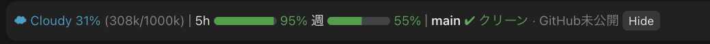

# context-git-band

[English](README.md)

Claude Code の mod です（Claude Code 2.1.287 以降が必要）。ターミナルでもデスクトップの Code タブでも、プロンプトの上に次の 1 行を表示します。



ターミナルでは次のようになります。

```
☂ Showers 54% (108k/200k) │ 5h ████████▊░ 88% 週 ███████▋░░ 77% │ main ● [5 未コミット] · ↑2 未push  [Hide]
```

Claude Code 専用です。Codex には mod の仕組みがありません。

## 表示するもの

### コンテキストの天気

- モデルのコンテキストウィンドウ全体に対する使用量の割合を、天気で表します。☀ Clear（25% 未満）、☁ Cloudy、☂ Showers（50%）、☇ Storm（75%）、↯ Compact Soon（90%）。使用トークン数も添えます。

### compact リンク

- Claude Code の自動 compact の 50k トークン手前から、ターンの合間に、天気の部分がリンク（`☂ Showers 60% (120k/200k) ⟲ compact`）になります。そのときに 1 回だけ通知も出ます。
- リンクを押すと、`/compact` と同じ処理で会話を compact します。終わるまで `⟳ Compacting…` と表示します。
- 自動 compact の地点は、毎ターン Claude Code 本体から読みます（`/context` の内訳の `autoCompactThreshold`。手元での見積もりで、問い合わせは発生しません）。実測ではウィンドウから 33k を引いた地点でした。そのため、リンクになるのは 200k なら 117k（58.5%）、1M なら 917k からです。自動 compact をオフにしているときは、ウィンドウ全体を上限として扱います。
- ターン中は compact が受け付けられないので、普通の文字のままです。

### サブスクリプションの残量

- 5 時間枠と週間枠の残量を、残りの割合と 10 マスのゲージで表します。残量が多いときは緑、25% 以下で黄色、10% 以下で赤です。ターミナルではブロック文字（1 マスを 8 段階）で、デスクトップの Code タブでは角丸の SVG バーで描きます。
- 値は 2 つの経路から取り、新しいほうを表示します。
  - このセッションの API の応答（`session.measure` の `rateLimits`）。枠が 1 ポイント動いた時点ですぐに反映します。
  - アカウントの利用状況のエンドポイント `https://api.anthropic.com/api/oauth/usage`。ほかのセッションで使った分もここで拾います。セッションの認証情報（`$.session.authorize()`）を付けて `$.http.fetch` で取得するので、トークンは mod 側に渡りません。取得するのは、セッション開始時、ターンの終わり（1 分に 1 回まで）、それ以外は 3 分ごとです。失敗したときや 429 が返ったときは、待ち時間を倍にしていき、最大 15 分まで延ばします。
- 取得結果、最後に取った時刻、待ち時間は、プラグインの `$.store` に置きます。どのセッションもここを読むので、セッションをいくつ開いていても取得は 1 回分で済みます。
- このエンドポイントは公開されていないもので、変わったり使えなくなったりする可能性があります。
- どちらの経路にもまだ値がないうちは、何も表示しません。サブスクリプションでない場合（API キー）も表示しません。

### Git の状態

- セッションのフォルダのブランチ、未コミットのファイル数、未 push のコミット数（↑）、取り込んでいないコミット数（↓）を表示します。
- upstream のないブランチは `GitHub未公開` と表示します。リモートが GitHub 以外だけのリポジトリでは `upstreamなし` と表示します。
- 読み取るのは、セッション開始時、プロンプトを送ったとき、Bash・Edit・Write ツールの実行後（2 秒に 1 回まで）、ターンの終わりです。
- Git リポジトリでないフォルダや、コマンドを実行できない環境（`$.process` は CLI だけ）では、コンテキストの部分だけを表示します。
- 未コミットのファイルがあるときは、その件数がボタンになります。押すと `未コミットの変更をコミットして` をプロンプトとして送り、セッションがコミット作業を始めます（ターン中なら、終わってから送られます）。

### Hide

- `Hide` を押すと、1 行が小さな `▸ ctx/git` ボタンにたたまれます。もう一度押すと元に戻ります。
- ほかの mod の band とは、上下に積み重ねて表示します。

## 表示言語

band の言葉（`5h`/`週`、`未コミット`、`クリーン`、`GitHub未公開`、`未push`、未コミットのボタンで送るプロンプト）は、日本語か英語で表示します。天気の名前は、どちらでも英語です。

プラグインの設定項目 `language` で決まり、既定は `auto` です。

- `auto`：Claude Code 自身の `language` 設定（Claude が返答する言語）に合わせます。日本語なら日本語、それ以外なら英語です。その設定がなければ、ロケール（`LC_ALL`、`LC_MESSAGES`、`LANG`）が `ja` で始まるときだけ日本語にし、それ以外は英語にします。どちらもない環境に初めて入れたときは英語です。
- `ja` か `en`：その言語に固定します。

`/config` パネルに `auto`、`ja`、`en` の選択肢として出るので、そこで変えます。値は `~/.claude/settings.json` の `pluginConfigs` に保存されます。言語はセッションを開いたときに決まります。

## インストール

正本はこのフォルダです。`suzuki-local-plugins` マーケットプレイス経由で入れます。

```bash
~/.claude/local-plugins/bin/claude-plugin-refresh context-git-band --execute
```

そのあと、Claude アプリを再起動するか、新しいセッションを開いてください。

## 確認

```bash
claude plugin validate ~/plugins/context-git-band
```

```bash
claude plugin test ~/plugins/context-git-band
```

## 着想元

天気にたとえる表示とその 5 段階は、Anthropic のブログ記事 [Getting started with Claude Code mods](https://claude.dev/blog/getting-started-with-claude-code-mods/) の Token Weather の例から着想を得ています。ここのコードは独自に書いたもので、その例のコードは含んでいません。

## ライセンス

[MIT](LICENSE)
