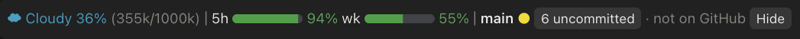

# context-git-band

[日本語](README.ja.md)

A Claude Code mod (needs Claude Code 2.1.288 or later; tested on 2.1.288 and 2.1.291). It draws one line above the prompt, in the terminal and in the desktop Code tab:



In the terminal, with `language` set to `en`:

```
☂ Showers 54% (108k/200k) │ 5h ████████▊░ 88% wk ███████▋░░ 77% │ main ● [5 uncommitted] · ↑2 unpushed  [Hide]
```

Claude Code only; Codex has no mods.

## What it shows

### Context window as weather

- The fill of the context window, as a share of the model's whole window: ☀ Clear (under 25%), ☁ Cloudy, ☂ Showers (50%), ☇ Storm (75%), ↯ Compact Soon (90%), with the tokens used.

### Compact link

- 50k tokens before Claude Code's own auto-compaction, between turns, the weather part is drawn as a link (`☂ Showers 60% (120k/200k) ⟲ compact`), and a toast says so once.
- Pressing the link compacts the conversation, the same call `/compact` makes; the band shows `⟳ Compacting…` until it ends.
- The auto-compaction point is read from the engine each turn (`autoCompactThreshold` of the `/context` breakdown, estimated locally, no request). Measured, it is the window less 33k, so the link comes at 117k of 200k (58.5%) and 917k of 1M. With auto-compaction off, the window itself is the limit.
- While a turn runs, the part stays plain text, since a compaction is refused then.

### Subscription quota

- What is left of the 5-hour and weekly windows, as remaining percent, each with a 10-cell gauge: green, yellow at 25% or less, red at 10% or less. The terminal draws the gauge in block characters (eighths of a cell); the desktop Code tab draws it as a rounded SVG bar.
- Two sources, the newer reading shown:
  - this session's own API responses (`session.measure`'s `rateLimits`), shown the moment a window moves a whole point;
  - the account usage endpoint `https://api.anthropic.com/api/oauth/usage`, so use from other sessions shows too. It is fetched through `$.http.fetch` with the session's own credential (`$.session.authorize()`; the token never reaches the mod): at session start, when a turn ends (at most once a minute) and otherwise every 3 minutes. A failure or a 429 doubles the wait, up to 15 minutes.
- The newest reading and the poll's own bookkeeping (last fetch time, backoff, a claim) are kept apart in the plugin's `$.store`, which every session reads, so open sessions share one fetch and none overwrites another's backoff.
- The endpoint is not part of Anthropic's public API: it may change or stop working at any time, and whether the terms of service allow a third-party tool to call it has not been confirmed. Use it at your own risk; with no subscription sign-in, the mod never calls it.
- Nothing shows until one of the sources has a reading, nor off a subscription (an API key).

### Git state

- The session folder's branch, uncommitted files, unpushed commits (↑) and commits behind (↓).
- A branch with no upstream shows `not on GitHub`. It shows `no upstream` instead when a remote already has a branch of that name (pushed without `-u`), or when the repo's remotes are all off GitHub.
- It is read in the background at session start, on each prompt, after Bash/Edit/Write tool calls (at most once every 2 s) and when a turn ends, with `git --no-optional-locks`, so it never takes the index lock from your own git commands.
- In a folder that is not a Git repository, or on a host that cannot run commands (`$.process` is CLI only), the line shows the context part alone.
- When there are uncommitted files, the count is a button: pressing it submits `Commit the uncommitted changes` (in the band's language) as your prompt, so the session starts the commit (queued until the current turn ends).

### Hide

- `Hide` collapses the line to a small `▸ ctx/git` button; press it to bring the line back.
- The band stacks with the bands of other mods beneath it.

## Language

The band's own words (`wk`, `uncommitted`, `clean`, `not on GitHub`, `unpushed`, the prompt the uncommitted button sends, and the toasts) follow the language you use. The weather names and the short labels (`5h`, `Hide`, `compact`) stay English.

The plugin's `language` option picks the language, `auto` by default:

- `auto`, in the desktop Code tab, follows the Claude desktop app's display language. It is read from `locale` in the app's own `~/Library/Application Support/Claude/config.json`: an internal file, not a documented interface, which also holds the app's sign-in cache, so the mod reads it again only when its modification time moves and keeps nothing but `locale`.
- `auto`, in the terminal (and in the desktop when the app's language cannot be read), follows Claude Code's own `language` setting (the language Claude replies in), then the locale (`LC_ALL`, `LC_MESSAGES`, `LANG`). With neither, it is English.
- `ja` or `en` fixes Japanese or English on every surface.

Japanese and English are written into the mod. Any other language is translated from English the first time it appears, by one small model call (`haiku`, through the session's own client, so it counts against your usage). Until it lands, the band shows English; it then switches within seconds. The translation is kept in the plugin's `$.store` per language and reused by every session, and translated again only when the English words change. A translation that loses a `{placeholder}`, runs too long for the band, or is not well-formed is thrown away, and that language then stays in English in every session, with no further call, until the English words change.

A switch shows without a new session: a change of Claude Code's `language` in `/config` at once, any other change within 3 seconds.

Change the option in the `/config` panel, where it is a picker of `auto`, `ja` and `en`; the value is saved under `pluginConfigs` in `~/.claude/settings.json`.

## Install

In a Claude Code session (2.1.288 or later):

```text
/plugin install context-git-band --marketplace mlabo-org/context-git-band
```

Or from your shell:

```bash
claude plugin marketplace add mlabo-org/context-git-band
```

```bash
claude plugin install context-git-band@context-git-band
```

Then start a new session. In the desktop app, you can also add the marketplace and install from **+ > Plugins**.

To try a local copy for one session without installing it:

```bash
claude --plugin-dir /path/to/context-git-band
```

## Check

```bash
claude plugin validate ~/plugins/context-git-band
```

```bash
claude plugin test ~/plugins/context-git-band
```

## Credits

The weather metaphor and its five levels come from the Token Weather example in [Getting started with Claude Code mods](https://claude.dev/blog/getting-started-with-claude-code-mods/) on the Anthropic blog. The code here is written independently and does not include that example's code.

## License

[MIT](LICENSE)
